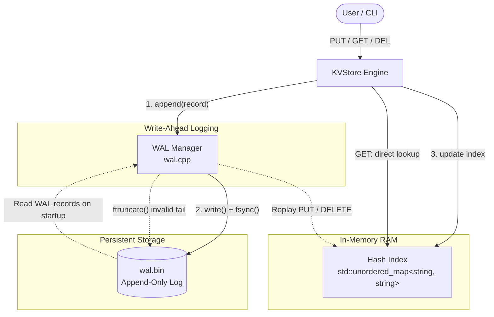

# KV Store

A single-node persistent key-value store implemented in C++, using an append-only write-ahead log (WAL) and an in-memory hash index.

## Features

- PUT / GET / DELETE
- Append-only WAL
- Durable writes using fsync()
- Crash recovery through WAL replay
- Truncation of incomplete final records
- In-memory hash index
- CMake build

## Architecture


## Build

```bash
cmake -S . -B build
cmake --build build
cd build
```

## Run

Run the KV Store:
```bash
./kvstore
```

Run the benchmarks:
```bash
./kvstore_bench
```

Run the tests:
```bash
ctest
```

## Example


```text
> put name Alice
> get name
Alice

> del name
> get name
Key don't exist
```

## Benchmarks

The project includes a simple benchmark for measuring:

- PUT throughput
- GET throughput
- WAL recovery time

### Workload

| Benchmark | Operations | Workload |
|---|---:|---|
| PUT | 10,000 | Insert unique `Key0` ... `Key9999` with corresponding values |
| GET | 10,000 | Read the same 10,000 existing keys from the in-memory hash index |
| Recovery | 10,000 WAL records | Replay the WAL and rebuild the in-memory index |

For each PUT, the WAL record is written to disk and `fsync()` is called before the in-memory index is updated.

### Results

Benchmark run on an Azure VM:

| Benchmark | Result |
|---|---:|
| PUT throughput | 324.3 ops/sec |
| GET throughput | 3.33M ops/sec |
| WAL recovery | 7 ms |

### Benchmark Environment

- CPU: AMD EPYC 7763
- vCPU: 2
- Memory: 8 GB
- Architecture: x86_64
- Environment: Microsoft Azure VM
- C++ standard: C++17

Results depend on hardware, storage performance, VM configuration, Design and Implementation.
